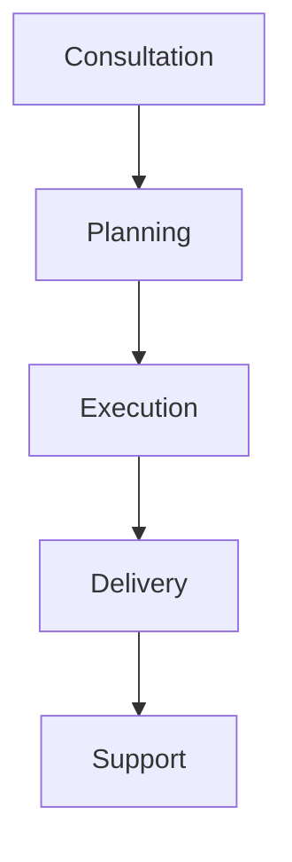

[🏠 <mark>Home</mark>](https://github.com/sekirosha/home/blob/main/README.md#welcome-to-sekirosha) | [ℹ️ <mark>About</mark>](https://github.com/sekirosha/about_sekirosha?tab=readme-ov-file#about_sekirosha) | [💼 <mark>Services</mark>](https://github.com/sekirosha/home/blob/main/README.md#our-services) | [📝 <mark>Blog</mark>](https://www.facebook.com/profile.php?id=61571348574848) | [📞 <mark>Contact</mark>](https://github.com/sekirosha/home/blob/main/README.md#build-something-amazing)

# Welcome to <mark>SEKIROSHA</mark>
SEKIROSHA is where creativity and technology converge to deliver exceptional solutions for businesses and individuals alike. We specialize in <mark>web development</mark>, <mark>app development</mark>, <mark>product design</mark>, and a unique touch with our <mark>event planning</mark> services. Whether you're looking to transform your digital presence or create unforgettable experiences, **SEKIROSHA is your trusted partner**.

 

# SEKIROSHA 
SEKIROSHA is a forward-thinking software company that blends creativity with technology. We specialize in **web development**, **app development**, and **product design**, using the latest tools and techniques to bring your digital ideas to life. But what sets us apart is our unique offering of **Event Planning**. We don’t just build websites or apps; we create experiences.

Whether you need a <i><b>custom-built website</i></b>, a <i><b>mobile app</i></b>, or a stunning <i><b>product design</i></b> using <a href="https://www.figma.com/">Figma</a>, SEKIROSHA has you covered. And with our Event Planning services, we bring the same level of innovation and attention to detail, ensuring that every event, from corporate meetings to special celebrations, is unforgettable.

# Our Services
<table>
  <tr>
    <th>web development</th>
    <th>app development</th>
    <th>product design</th>
    <th>event planner</th>
  </tr>
  <tr>
    <td>Your website is your digital storefront, and we make it shine. At SEKIROSHA, we design and develop dynamic, user-friendly websites that engage your audience and drive results. 
        Whether it's a sleek portfolio, a powerful e-commerce platform, or a fully custom solution, we’ve got you covered.</td>
    <td>In a mobile-first world, having the right app can set you apart. Our team builds intuitive, scalable, and feature-rich mobile applications tailored to meet your specific needs. 
        From concept to launch, we bring your ideas to life on iOS, Android, or cross-platform solutions.</td>
    <td>Great products start with great design. Using industry-leading tools like Figma, our design experts craft user-centered experiences that are both beautiful and functional. From 
        wireframes to polished prototypes, we ensure your product stands out in the market.</td>
    <td>SEKIROSHA takes innovation beyond tech with our unique event planning services. Whether it’s a corporate gathering, product launch, or a creative community event, we manage every 
        detail to ensure it’s memorable. Let us handle the logistics while you focus on making an impact. </td>
  </tr>
  <tr>
    <td><a href="#"><mark>make a deal</mark></a></td>
    <td><a href="#"><mark>make a deal</mark></a></td>
    <td><a href="#"><mark>make a deal</mark></a></td>
    <td><a href="#"><mark>make a deal</mark></a></td>
  </tr>
</table>

# Why Choose SEKIROSHA?
<ul>
  <li><mark>Innovation Meets Expertise</mark>: We combine cutting-edge technology with creative design to deliver results that exceed expectations.</li>
  <li><mark>End-to-End Solutions</mark>: From digital platforms to real-world events, we provide a comprehensive range of services tailored to your needs.</li>
  <li><mark>Client-Centric Approach</mark>: Your goals are our priority. We work closely with you to ensure every project reflects your vision.</li>
  <li><mark>Experienced Team</mark>: Our skilled professionals bring years of expertise and a passion for innovation to every project.</li>
</ul>

# Our Process

# <mark>Your ideas</mark>, our expertise 
We believe that technology and creativity go hand in hand, and we’re here to help you navigate both worlds with ease. Your ideas, our expertise — let’s build something amazing together.

# Build Something Amazing
<mark>**Follow us**</mark>  
<b> Social Media </b> : <a href="https://www.facebook.com/profile.php?id=61571348574848"> Facebook </a>, <a href="https://github.com/sekirosha">GitHub</a>
  <b> Email </b> : <u>sekirosha.official@gmail.com </u>  

---
## Useful Links
[Privacy Policy](#) | [Terms of Service](#) | [FAQ](#)  
© 2024 SEKIROSHA. All Rights Reserved.
